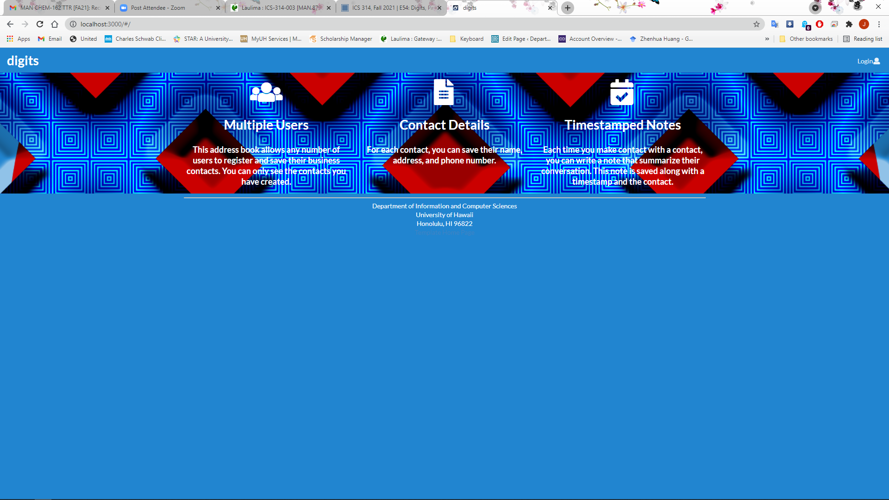
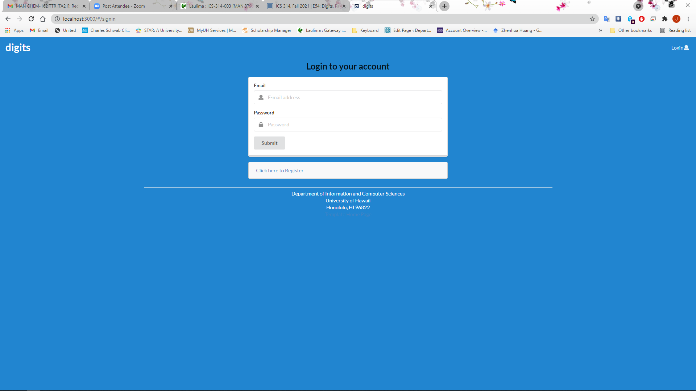
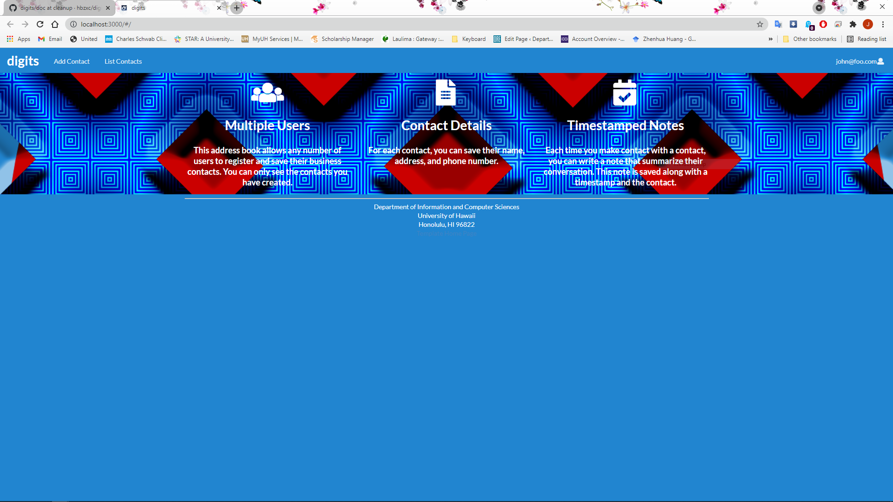
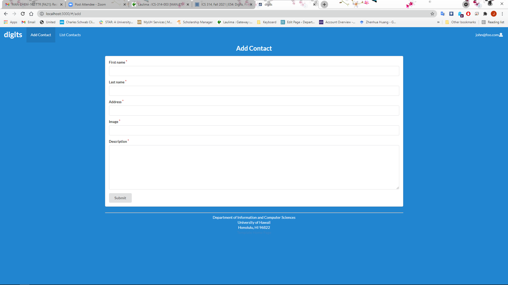
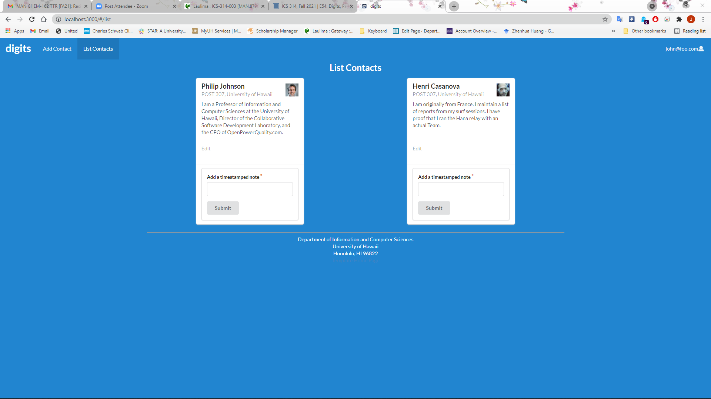
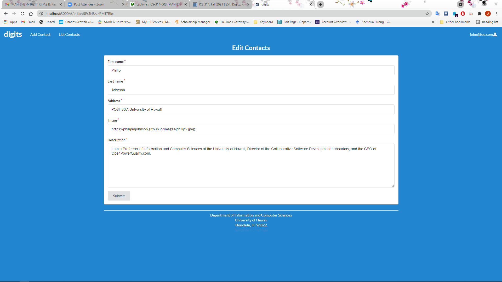
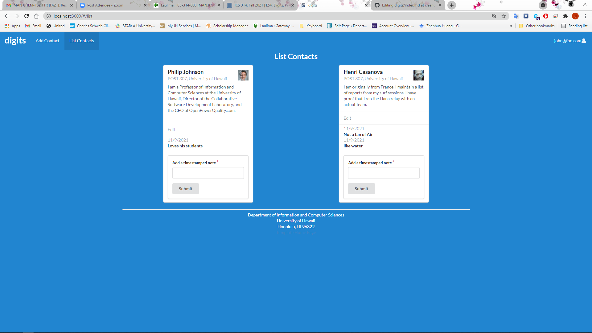
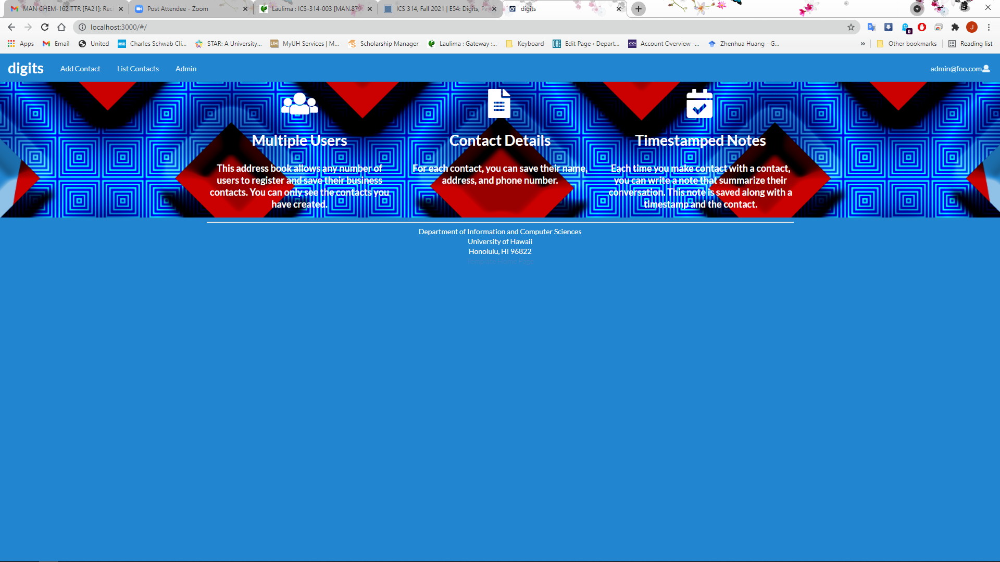
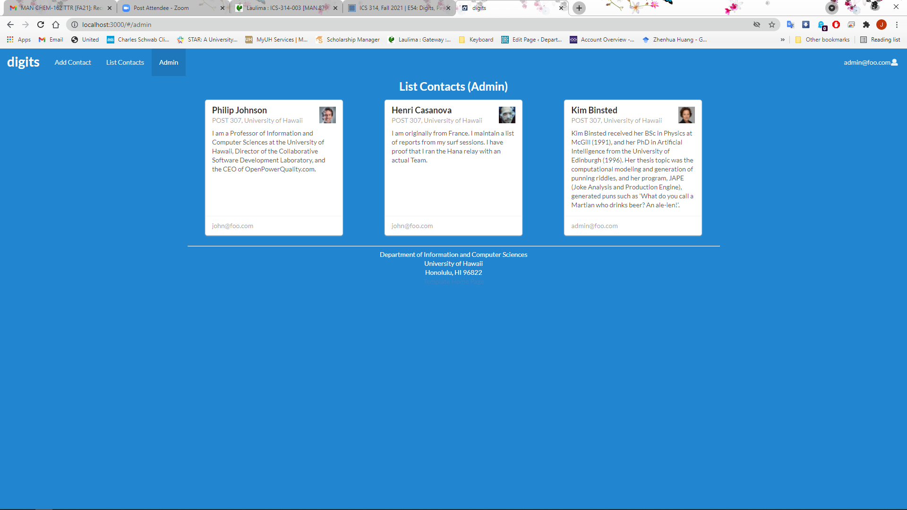

## Installation

First, [install Meteor](https://www.meteor.com/install).

Second, "Clone or download" this repository.  Using [GitHub Desktop](https://desktop.github.com/) is a great choice if you use MacOS or Windows.

Third, cd into the app/ directory of your local copy of the repo, and install third party libraries with:

```
$ meteor npm install
```

## Running the system

Once the libraries are installed, you can run the application by invoking the "start" script in the [package.json file](https://github.com/ics-software-engineering/meteor-application-template-react/blob/master/app/package.json):

```
$ meteor npm run start
```

The first time you run the app, it will create some default users and data. Here is the output:

```
meteor npm run start

> meteor-application-template-react@ start /Users/philipjohnson/github/ics-software-engineering/meteor-application-template-react/app
> meteor --no-release-check --settings ../config/settings.development.json

[[[[[ ~/github/ics-software-engineering/meteor-application-template-react/app ]]]]]

=> Started proxy.
=> Started MongoDB.
I20211109-12:02:16.083(-10)? Creating the default user(s)
I20211109-12:02:16.085(-10)?   Creating user admin@foo.com.
I20211109-12:02:16.151(-10)?   Creating user john@foo.com.
I20211109-12:02:16.211(-10)? Creating default data.
I20211109-12:02:16.212(-10)?   Adding: Philip (john@foo.com)
I20211109-12:02:16.221(-10)?   Adding: Henri (john@foo.com)
I20211109-12:02:16.222(-10)?   Adding: Kim (admin@foo.com)
I20211109-12:02:16.247(-10)? Monti APM: completed instrumenting the app
=> Started your app.

=> App running at: http://localhost:3000/
```

### Viewing the running app

If all goes well, the template application will appear at [http://localhost:3000](http://localhost:3000).  You can login using the credentials in [settings.development.json](https://github.com/ics-software-engineering/meteor-application-template-react/blob/master/config/settings.development.json), or else register a new account.

### ESLint

You can verify that the code obeys our coding standards by running ESLint over the code in the imports/ directory with:

```
meteor npm run lint
```

### Application functionality
By default, each user only sees the Contacts that they have created.  However, the settings file enables you to define default accounts.  If you define a user with the role "admin", then that user gets access to a special page which lists all the Contacts defined by all users.

#### Landing page

When you retrieve the app at http://localhost:3000, this is what should be displayed:


The next step is to use the Login menu to either Login to an existing account or register a new account.

#### Login page

Clicking on the Login link, then on the Sign In menu item displays this page:



#### Register page

Alternatively, clicking on the Login link, then on the Sign Up menu item displays this page:


#### Landing (after Login) page, non-Admin user

Once you log in (either to an existing account or by creating a new one), the navbar changes as follows:



You can now add new Contacts, and list the Contacts you have created. Note you cannot see any Contacts created by other users.

#### Add Contact page

After logging in, here is the page that allows you to add new Contacts:



#### List Contacts page

After logging in, here is the page that allows you to list all the Contacts you have created:



You click the "Edit" link to go to the Edit Contact page, shown next.

#### Edit Contact page

After clicking on the "Edit" link associated with an item, this page displays that allows you to change and save it:



#### Adding Notes

Users can add notes to their Contacts



After typing their note clicking "Submit" will append it to the Contact with a date

#### Landing (after Login), Admin user

You can define an "admin" user in the settings.json file. This user, after logging in, gets a special entry in the navbar:



#### Admin page (list all Contacts)

To provide a simple example of a "super power" for Admin users, the Admin page lists all of the Contacts by all of the users:



Note that non-admin users cannot get to this page, even if they type in the URL by hand.
